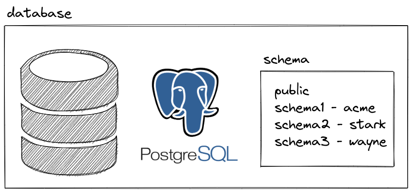
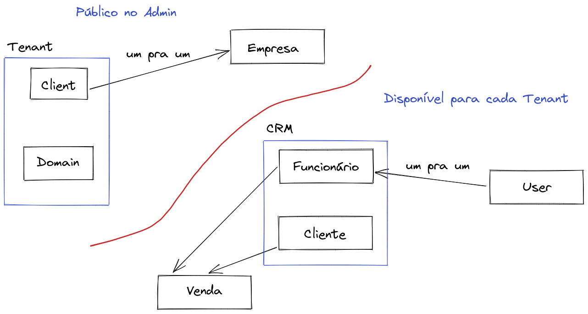
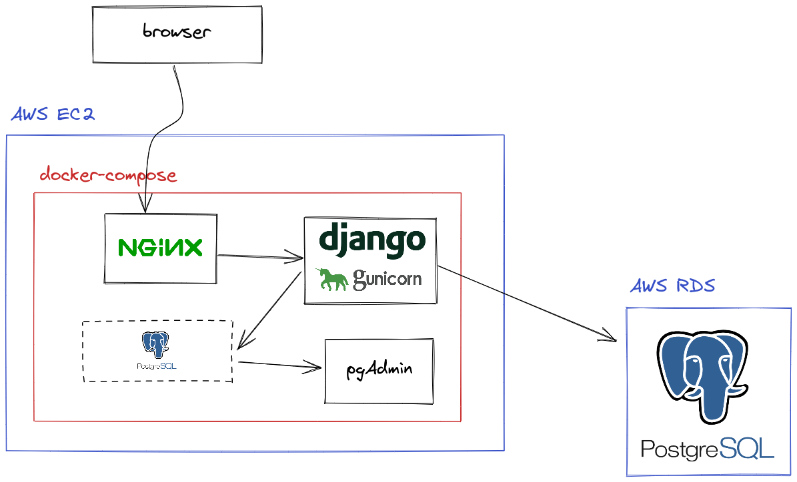

# django-tenants-tutorial

Tutorial baseado em https://django-tenants.readthedocs.io/en/latest/index.html


## Este projeto foi feito com:

* [Python 3.10.4](https://www.python.org/)
* [Django 4.0.7](https://www.djangoproject.com/)
* [django-tenants 3.4.3](https://django-tenants.readthedocs.io/en/latest/)
* [Bulma CSS](https://bulma.io/)

## Como rodar o projeto?

* Clone esse repositório.
* Crie um virtualenv com Python 3.
* Ative o virtualenv.
* Instale as dependências.
* Rode as migrações.

```
git clone https://github.com/rg3915/django-tenants-tutorial.git
cd django-tenants-tutorial
python -m venv .venv
source .venv/bin/activate
pip install -r requirements.txt
python contrib/env_gen.py

docker-compose up -d  # O objetivo é rodar o PostgreSQL

python manage.py migrate
python manage.py test
python manage.py createsuperuser --username="admin" --email=""
```

Opcionalmente você pode rodar o [Portainer](https://docs.portainer.io/start/install/server/docker)

```
docker run -d \
--name myportainer \
-v /opt/portainer:/data \
portainer/portainer
```

## Mais recursos

* Atualização dos Tipos de Produtos em todos os tentants.

https://django-tenants.readthedocs.io/en/latest/use.html#running-code-across-every-tenant

```
python manage.py update_product_type_on_tentants
```


# links

https://django-tenants.readthedocs.io/en/latest/index.html

https://github.com/django-tenants/django-tenants

https://youtu.be/TWF7okf5Xoo

https://youtu.be/IrAz-q5rv3A

https://blog.4linux.com.br/schemas-e-namespaces-postgresql-com-django/


# Passo a passo para criar do zero

```
git clone https://github.com/rg3915/django-tenants-tutorial.git
cd django-tenants-tutorial
python -m venv .venv
source .venv/bin/activate
python contrib/env_gen.py

docker-compose up -d  # O objetivo é rodar o PostgreSQL

git checkout base
```

# Parte 1

## Instalação

```
pip install -U pip
pip install Django==4.0.7 django-tenants==3.4.3 django-extensions psycopg2-binary python-decouple
```

## Cria o projeto

**Obs:** Na verdade já foi criado na branch.

```
django-admin startproject backend .
```

Configura o settings.py com o básico (já está pronto!).

```python
# settings.py
from pathlib import Path

from decouple import Csv, config

# Build paths inside the project like this: BASE_DIR / 'subdir'.
BASE_DIR = Path(__file__).resolve().parent.parent

# Quick-start development settings - unsuitable for production
# See https://docs.djangoproject.com/en/4.0/howto/deployment/checklist/

# SECURITY WARNING: keep the secret key used in production secret!
SECRET_KEY = config('SECRET_KEY')

# SECURITY WARNING: don't run with debug turned on in production!
DEBUG = config('DEBUG', default=False, cast=bool)

ALLOWED_HOSTS = config('ALLOWED_HOSTS', default=[], cast=Csv())

# ...

LANGUAGE_CODE = 'pt-br'

TIME_ZONE = 'America/Sao_Paulo'

STATIC_URL = 'static/'
STATIC_ROOT = BASE_DIR.joinpath('staticfiles')
```

### Gera as variáveis de ambiente

Daqui pra baixo precisar implementar...

```
python contrib/env_gen.py
```

## Configura o banco de dados em settings.py

```python
# settings.py
DATABASES = {
    'default': {
        'ENGINE': 'django_tenants.postgresql_backend',
        'NAME': config('POSTGRES_DB', 'db'),  # postgres
        'USER': config('POSTGRES_USER', 'postgres'),
        'PASSWORD': config('POSTGRES_PASSWORD', 'postgres'),
        # 'db' caso exista um serviço com esse nome.
        'HOST': config('DB_HOST', '127.0.0.1'),
        'PORT': 5433,
    }
}
```


## Criando schemas manualmente





E acompanhar pelo pgAdmin.

```
docker container ls

docker container exec -it db psql


CREATE DATABASE test;
\l
\c test

CREATE SCHEMA my_schema01;
\dn

CREATE TABLE my_schema01.cities (id SERIAL PRIMARY KEY, city VARCHAR(50), uf VARCHAR(2));
\dt my_schema01.*

INSERT INTO my_schema01.cities (city, uf) VALUES ('São Paulo', 'SP');
SELECT * FROM my_schema01.cities;

CREATE SCHEMA my_schema02;
\dn

CREATE TABLE my_schema02.cities (id SERIAL PRIMARY KEY, city VARCHAR(50), uf VARCHAR(2));
\dt my_schema02.*

INSERT INTO my_schema02.cities (city, uf) VALUES ('Bahia', 'BA');
SELECT * FROM my_schema02.cities;

DROP TABLE my_schema01.cities;
DROP TABLE my_schema02.cities;

DROP SCHEMA my_schema01;
DROP SCHEMA my_schema02;
\dn

# Saia do postgres

docker container stop pgadmin

docker container exec -it db psql

\c postgres
DROP DATABASE test;
\l
```

## Configurando Tenant

### Cria app tenant

```
cd backend
python ../manage.py startapp tenant
cd ..
```

### Edita apps.py

```python
# tenant/apps.py
...
name = 'backend.tenant'
```

### Edita models.py

```python
# tenant/models.py
from django.db import models
from django_tenants.models import DomainMixin, TenantMixin


class Client(TenantMixin):
    name = models.CharField(max_length=100)
    on_trial = models.BooleanField(default=True)
    created_on = models.DateField(auto_now_add=True)

    # default true, schema will be automatically created and synced when it is saved
    auto_create_schema = True


class Domain(DomainMixin):
    ...
```

### Edita admin.py

```python
# tenant/admin.py
from django.apps import apps
from django.contrib import admin
from django_tenants.utils import get_public_schema_name


class TenantsAdmin(admin.ModelAdmin):
    '''
    Hides public models from tenants
    https://stackoverflow.com/a/66898816
    '''

    def has_view_permission(self, request, view=None):
        try:
            if request.tenant.schema_name == get_public_schema_name():
                return True
            return False
        except AttributeError:
            return True
        except Exception as e:
            raise e

    def has_add_permission(self, request, view=None):
        return False

    def has_change_permission(self, request, view=None):
        return False

    def has_delete_permission(self, request, view=None):
        return False

    def has_view_or_change_permission(self, request, view=None):
        try:
            if request.tenant.schema_name == get_public_schema_name():
                return True
            return False
        except AttributeError:
            return True
        except Exception as e:
            raise e


app = apps.get_app_config('tenant')
for model_name, model in app.models.items():
    admin.site.register(model, TenantsAdmin)
```

Deletando algumas coisas

```
rm -f backend/tenant/tests.py
rm -f backend/tenant/views.py
```

### settings.py

```python
# settings.py
SHARED_APPS = (
    'django_tenants',  # mandatory
    'backend.tenant',  # you must list the app where your tenant model resides in
    # 'backend.company',

    # everything below here is optional
    'django.contrib.admin',
    'django.contrib.auth',
    'django.contrib.contenttypes',
    'django.contrib.sessions',
    'django.contrib.messages',
    'django.contrib.staticfiles',

    # others apps
    'django_extensions',
)

TENANT_APPS = (
    'django.contrib.admin',
    'django.contrib.auth',
    'django.contrib.contenttypes',
    'django.contrib.sessions',
    'django.contrib.messages',
    'django.contrib.staticfiles',

    # your tenant-specific apps
    # 'backend.core',
    # 'backend.crm',
    # 'backend.sale',
)

INSTALLED_APPS = list(SHARED_APPS) + [app for app in TENANT_APPS if app not in SHARED_APPS]

TENANT_MODEL = "tenant.Client"  # app.Model

TENANT_DOMAIN_MODEL = "tenant.Domain"  # app.Model


MIDDLEWARE = [
    'django_tenants.middleware.main.TenantMainMiddleware',  # <<<
    'django.middleware.security.SecurityMiddleware',
    ...
]

DATABASE_ROUTERS = (
    'django_tenants.routers.TenantSyncRouter',
)
```

```
python manage.py makemigrations            # caso tenha alterações nos models
python manage.py migrate_schemas --shared
python manage.py create_tenant             # Cria um novo tenant
python manage.py create_tenant_superuser   # Cria um novo super user para o tenant escolhido
python manage.py migrate_schemas
```

```
schema name: acme
name: Acme Corp.
on trial: True
domain: acme.localhost
is_primary: True

schema name: stark
name: Stark Industries
on trial: True
domain: stark.localhost
is_primary: True
```

Já podemos acessar

```
acme.localhost:8000/admin
stark.localhost:8000/admin
```

Crie esses dois usuários.

stark: Howard Stark, Tony Stark


Se você acessar localhost:8000/admin vai dar erro, então


### Configurando settings.py

```
cp backend/urls.py backend/urls_public.py
```


```python
# settings.py
PUBLIC_SCHEMA_URLCONF = 'backend.urls_public'

SHOW_PUBLIC_IF_NO_TENANT_FOUND = True
```


## Acessando o shell_plus para cada tenant

```
python manage.py tenant_command shell_plus --schema=stark
```

```python
>>> User.objects.all()
<QuerySet [<User: admin>, <User: howard>, <User: tony>]>
```

```
python manage.py tenant_command shell_plus --schema=acme
```

Crie o usuário

acme: stewart


```python
>>> User.objects.all()
<QuerySet [<User: admin>, <User: stewart>]>
```


## App company com model Company OneToOne(Client)

Company deve ser global.

```
cd backend
python ../manage.py startapp company
cd ..
```

### Edita apps.py

```python
# company/apps.py
...
name = 'backend.company'
```


### Edita models.py

```python
# company/models.py
from django.db import models

from backend.tenant.models import Client


class Company(models.Model):
    name = models.CharField('nome', max_length=100, unique=True)
    cnpj = models.CharField('CNPJ', max_length=14, unique=True, null=True, blank=True)
    client = models.OneToOneField(
        Client,
        on_delete=models.CASCADE,
        verbose_name='cliente',
        related_name='companies',
    )

    class Meta:
        ordering = ('name',)
        verbose_name = 'empresa'
        verbose_name_plural = 'empresas'

    def __str__(self):
        return f'{self.name}'
```

### Edita tenant/admin.py

```python
# tenant/admin.py
...

class CompanyAdmin(admin.ModelAdmin):
    '''
    Hides public models from tenants
    https://stackoverflow.com/a/66898816
    '''
    readonly_fields = ('client',)

    def has_view_permission(self, request, view=None):
        try:
            if request.tenant.schema_name == get_public_schema_name():
                return True
            return False
        except AttributeError:
            return True
        except Exception as e:
            raise e

    def has_add_permission(self, request, view=None):
        return False

    def has_change_permission(self, request, view=None):
        try:
            if request.tenant.schema_name == get_public_schema_name():
                return True
            return False
        except AttributeError:
            return True
        except Exception as e:
            raise e

    def has_delete_permission(self, request, view=None):
        return False

    def has_view_or_change_permission(self, request, view=None):
        try:
            if request.tenant.schema_name == get_public_schema_name():
                return True
            return False
        except AttributeError:
            return True
        except Exception as e:
            raise e


...


app = apps.get_app_config('company')
for model_name, model in app.models.items():
    admin.site.register(model, CompanyAdmin)
```

Deletando algumas coisas

```
rm -f backend/company/admin.py
rm -f backend/company/tests.py
rm -f backend/company/views.py
```

### Edita settings.py

```python
SHARED_APPS = (
    'django_tenants',  # mandatory
    'backend.tenant',  # you must list the app where your tenant model resides in
    'backend.company',
    ...
)
```

### Migrações

```
python manage.py makemigrations
python manage.py migrate
```

> Repare que temos Empresa no Admin público, mas não no tenant.


### Cadastrando Empresa pelo shell_plus

```python
python manage.py shell_plus

acme = Client.objects.get(schema_name='acme')
Company.objects.create(name='Acme Corp.', cnpj='48085893000141', client=acme)

stark = Client.objects.get(schema_name='stark')
Company.objects.create(name='Stark Industries', cnpj='77863660000120', client=stark)
```


## App crm com model Employee OneToOne(User)

```
cd backend
python ../manage.py startapp crm
cd ..
rm -f backend/crm/tests.py
```

### Edite settings.py

```python
# settings.py
TENANT_APPS = (
    ...
    'backend.crm',
)
```

### Edite apps.py

```python
# crm/apps.py
...
name = 'backend.crm'
```

### Edite models.py

```python
# crm/models.py
from django.contrib.auth.models import User
from django.db import models


class Employee(models.Model):
    occupation = models.CharField('cargo', max_length=30, null=True, blank=True)
    cpf = models.CharField('CPF', max_length=11, null=True, blank=True)
    user = models.OneToOneField(
        User,
        on_delete=models.CASCADE,
        verbose_name='usuário',
        related_name='employees',
    )

    class Meta:
        ordering = ('user__first_name',)
        verbose_name = 'funcionário'
        verbose_name_plural = 'funcionários'

    def __str__(self):
        return f'{self.user.get_full_name()}'
```

### Edite admin.py

```python
# crm/admin.py
from django.contrib import admin

from .models import Employee


@admin.register(Employee)
class EmployeeAdmin(admin.ModelAdmin):
    list_display = ('__str__', 'cpf', 'occupation')
    search_fields = ('user__first_name', 'user__last_name', 'user__email')
```

> Veja no Admin que o crm aparece nos tenants, mas não no público.


## Cria Customer

### Edite models.py

```python
# crm/models.py
class Customer(models.Model):
    name = models.CharField('nome', max_length=100, unique=True)

    class Meta:
        ordering = ('name',)
        verbose_name = 'cliente'
        verbose_name_plural = 'clientes'

    def __str__(self):
        return f'{self.name}'
```

### Edite admin.py

```python
# crm/admin.py
from .models import Customer, Employee


@admin.register(Customer)
class CustomerAdmin(admin.ModelAdmin):
    list_display = ('__str__',)
    search_fields = ('name',)
```


## Ao cadastrar o funcionário, cria o usuário e o associa ao funcionário.


### Cria templates

```
mkdir -p backend/crm/templates/crm
touch backend/crm/templates/crm/employee_form.html
```

```html
<!-- employee_form.html -->
<form action="." method="POST">
  
  {{ form.as_p }}
  <button type="submit">Salvar</button>
</form>
```


### Edita crm/forms.py

```
touch backend/crm/forms.py
```

```python
# crm/forms.py
from django import forms

from .models import Employee


class EmployeeForm(forms.ModelForm):
    required_css_class = 'required'

    username = forms.CharField(
        label='Usuário',
        max_length=150,
    )
    first_name = forms.CharField(
        label='Nome',
        max_length=150,
    )
    last_name = forms.CharField(
        label='Sobrenome',
        max_length=150,
        required=False,
    )
    email = forms.EmailField(
        label='E-mail',
        required=False,
    )

    class Meta:
        model = Employee
        fields = (
            'username',
            'first_name',
            'last_name',
            'email',
            'occupation',
            'cpf',
        )
```


### Edita crm/views.py

```python
# crm/views.py
from django.contrib.auth.models import User
from django.http import HttpResponse
from django.shortcuts import redirect, render

from .forms import EmployeeForm
from .models import Employee


def create_new_user(form):
    # Cria o Usuário.
    user = User.objects.create(
        username=form.cleaned_data['username'],
        first_name=form.cleaned_data['first_name'],
        last_name=form.cleaned_data['last_name'],
        email=form.cleaned_data['email'],
    )
    return user


def create_new_employee(form, user):
    # Cria o Funcionário.
    Employee.objects.create(
        occupation=form.cleaned_data['occupation'],
        cpf=form.cleaned_data['cpf'],
        user=user,
    )


def employee_create(request):
    template_name = 'crm/employee_form.html'
    form = EmployeeForm(request.POST or None)

    if request.method == 'POST':
        if form.is_valid():
            form.save(commit=False)
            user = create_new_user(form)
            create_new_employee(form, user)
            # return redirect('crm:employee_list')
            return HttpResponse('OK')

    context = {'form': form}
    return render(request, template_name, context)
```


### Edita crm/urls.py

```
touch backend/crm/urls.py
```

```python
# crm/urls.py
from django.urls import path

from backend.crm import views as v

app_name = 'crm'


urlpatterns = [
    path('employee/create/', v.employee_create, name='employee_create'),
]
```

### Edita urls.py

```python
# urls.py
from django.contrib import admin
from django.urls import include, path

urlpatterns = [
    path('crm/', include('backend.crm.urls')),
    path('admin/', admin.site.urls),
]
```

Acesse http://stark.localhost:8000/crm/employee/create/

## App sale com model Sale, com employee(FK)

```
cd backend
python ../manage.py startapp sale
cd ..
rm -f backend/sale/tests.py
```

### Edite settings.py

```python
# settings.py
TENANT_APPS = (
    ...
    'backend.crm',
    'backend.sale',
)
```

### Edite apps.py

```python
# sale/apps.py
...
name = 'backend.sale'
```

### Edite models.py

```python
# sale/models.py
from django.db import models

from backend.crm.models import Customer, Employee


class Sale(models.Model):
    title = models.CharField('título', max_length=30)
    customer = models.ForeignKey(
        Customer,
        on_delete=models.SET_NULL,
        verbose_name='cliente',
        related_name='customer_sales',
        null=True,
        blank=True
    )
    employee = models.ForeignKey(
        Employee,
        on_delete=models.SET_NULL,
        verbose_name='vendedor',
        related_name='employees_sales',
        null=True,
        blank=True
    )
    created = models.DateTimeField(
        'criado em',
        auto_now_add=True,
        auto_now=False
    )
    modified = models.DateTimeField(
        'modificado em',
        auto_now_add=False,
        auto_now=True
    )

    class Meta:
        ordering = ('title',)
        verbose_name = 'venda'
        verbose_name_plural = 'vendas'

    def __str__(self):
        return f'{self.title}'
```

### Edite admin.py

```python
# sale/admin.py
from django.contrib import admin

from backend.sale.models import Sale


@admin.register(Sale)
class SaleAdmin(admin.ModelAdmin):
    list_display = ('__str__', 'customer', 'employee', 'created')
    search_fields = ('title',)
```

> Acesse as vendas pelo Admin.


## Cria app core com o template principal

lista: clientes, funcionários e vendas

```
cd backend
python ../manage.py startapp core
cd ..

rm -f backend/core/admin.py
rm -f backend/core/models.py
rm -f backend/core/tests.py

touch backend/core/urls.py
```

### Edite settings.py

```python
# settings.py
TENANT_APPS = (
    ...
    'backend.core',
    'backend.crm',
    'backend.sale',
)
```


### Edite core/apps.py

```python
# core/apps.py
...
name = 'backend.core'
```


### Edite core/views.py

```python
# core/views.py
from django.shortcuts import render

from backend.crm.models import Customer, Employee
from backend.sale.models import Sale


def index(request):
    template_name = 'index.html'
    customers = Customer.objects.all()
    employees = Employee.objects.all()
    sales = Sale.objects.all()
    context = {
        'customers': customers,
        'employees': employees,
        'sales': sales,
    }
    return render(request, template_name, context)
```


### Edite core/urls.py

```python
# core/urls.py
from django.urls import path

from .views import index

app_name = 'core'


urlpatterns = [
    path('', index, name='index'),
]
```


### Edite urls.py

```python
# urls.py
from django.contrib import admin
from django.urls import include, path

urlpatterns = [
    path('', include('backend.core.urls')),
    path('crm/', include('backend.crm.urls')),
    # path('sale/', include('backend.sale.urls')),
    path('admin/', admin.site.urls),
]
```


### Edite base.html

```
mkdir backend/core/templates
touch backend/core/templates/base.html
touch backend/core/templates/index.html
```

```html
<!-- base.html -->
<!DOCTYPE html>
<html lang="en">
  <head>
    <meta charset="utf-8">
    <meta http-equiv="X-UA-Compatible" content="IE=edge">
    <meta name="viewport" content="width=device-width, initial-scale=1.0, shrink-to-fit=no">
    <link rel="shortcut icon" href="http://html5-training-in-hyderabad.blogspot.com.br/favicon.ico">
    <link rel="shortcut icon" href="https://www.djangoproject.com/favicon.ico">
    <title>Django Tenant</title>

    <!-- Bulma -->
    <link rel="stylesheet" href="https://cdn.jsdelivr.net/npm/bulma@0.9.3/css/bulma.min.css">
  </head>
  <body>

    <div class="container is-fluid">
      <div class="notification is-primary">
        <h1 class="title"><b>{{ request.tenant.name }}</b></h1>
      </div>
      
    </div>
  </body>
</html>
```

### Edite index.html

```html
<!-- index.html -->



  <div class="columns">
    <div class="column">
      <h1 class="title">
        <a href="">Clientes</a>
      </h1>
      <ul>
        
          <li>{{ customer }}</li>
        
      </ul>
    </div>
    <div class="column">
      <h1 class="title">
        <a href="">Funcionários</a>
      </h1>
      <ul>
        
          <li>{{ employee }}</li>
        
      </ul>
    </div>
    <div class="column">
      <h1 class="title">
        <a href="">Vendas</a>
      </h1>
      <ul>
        
          <li>{{ sale }}</li>
        
      </ul>
    </div>
  </div>

```

Acesse http://stark.localhost:8000/


## App crm com lista de clientes e funcionários

```
touch backend/crm/templates/crm/customer_list.html
touch backend/crm/templates/crm/employee_list.html
```

### Edite customer_list.html

```html
<!-- customer_list.html -->



  <h1 class="title">Clientes
    <a href="">
      <small>Voltar</small>
    </a>
  </h1>
  <table class="table">
    <thead>
      <tr>
        <th>Nome</th>
      </tr>
    </thead>
    <tbody>
      
        <tr>
          <td>{{ object }}</td>
        </tr>
      
    </tbody>
  </table>

```


### Edite employee_list.html

```html
<!-- employee_list.html -->



  <h1 class="title">Funcionários
    <a href="">
      <small>Voltar</small>
    </a>
  </h1>
  <table class="table">
    <thead>
      <tr>
        <th>Nome</th>
      </tr>
    </thead>
    <tbody>
      
        <tr>
          <td>{{ object }}</td>
        </tr>
      
    </tbody>
  </table>

```

### Edite crm/urls.py

```python
# crm/urls.py
urlpatterns = [
    path('customer/', v.customer_list, name='customer_list'),
    path('employee/', v.employee_list, name='employee_list'),
    path('employee/create/', v.employee_create, name='employee_create'),
]
```

### Edite crm/views.py

```python
# crm/views.py
from .models import Customer, Employee

...

def customer_list(request):
    template_name = 'crm/customer_list.html'
    object_list = Customer.objects.all()
    context = {'object_list': object_list}
    return render(request, template_name, context)


def employee_list(request):
    template_name = 'crm/employee_list.html'
    object_list = Employee.objects.all()
    context = {'object_list': object_list}
    return render(request, template_name, context)
```

> Arrume os links de index.html.


## App sale com a lista de vendas

```
touch backend/sale/urls.py

mkdir -p backend/sale/templates/sale
touch backend/sale/templates/sale/sale_list.html
```

### Edite sale/sale_list.html

```python
<!-- sale/sale_list.html -->



  <h1 class="title">Vendas
    <a href="">
      <small>Voltar</small>
    </a>
  </h1>
  <table class="table">
    <thead>
      <tr>
        <th>Título</th>
        <th>Data</th>
        <th>Cliente</th>
        <th>Funcionário</th>
      </tr>
    </thead>
    <tbody>
      
        <tr>
          <td>{{ object.title }}</td>
          <td>{{ object.created|date:"d/m/Y" }}</td>
          <td>{{ object.customer }}</td>
          <td>{{ object.employee }}</td>
        </tr>
      
    </tbody>
  </table>

```

### Edite sale/urls.py

```python
# sale/urls.py
from django.urls import path

from backend.sale import views as v

app_name = 'sale'


urlpatterns = [
    path('', v.sale_list, name='sale_list'),
]
```

### Edite sale/views.py

```python
# sale/views.py
from django.shortcuts import render

from .models import Sale


def sale_list(request):
    template_name = 'sale/sale_list.html'
    object_list = Sale.objects.all()
    context = {'object_list': object_list}
    return render(request, template_name, context)
```


### Edite urls.py

```python
# urls.py
urlpatterns = [
    ...
    path('sale/', include('backend.sale.urls')),
    path('admin/', admin.site.urls),
]
```

## Adiciona link para cadastrar funcionário

### Edite crm/employee_list.html

```html
<a href="">
  <small>Voltar</small>
</a>
<a class="button is-primary" href="">Adicionar</a>
```

### Edite crm/employee_form.html

```html



  <div class="columns is-mobile is-centered">
    <div class="column is-half">
      <form action="." method="POST">
        
        {{ form.as_p }}
        <button class="button is-primary mt-3" type="submit">Salvar</button>
      </form>
    </div>
  </div>

```

### Edite crm/forms.py

```python
class EmployeeForm(forms.ModelForm):
    ...

    def __init__(self, *args, **kwargs):
        super().__init__(*args, **kwargs)
        for field_name, field in self.fields.items():
            field.widget.attrs['class'] = 'input mb-3'
```

### Edite crm/views.py

```python
def employee_create(request):
    ...
    # return HttpResponse('OK')
    return redirect('crm:employee_list')
```

# Deploy


